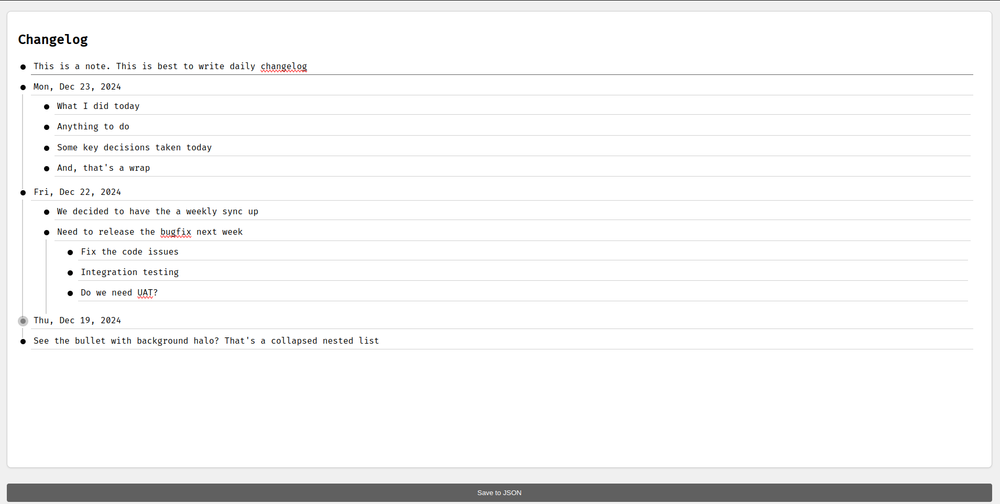

# Changelog

A web-based outliner application for organizing tasks and ideas.  
This project allows users to create, edit, and organize items in a hierarchical structure.

This was inspired by Workflowy which I've used in past and has grown a likeness to it.  
However, it's lack of local first approach prevents me from using it from more secure setups.
I've tried Obisidian and LogSeq but they doesn't feel right and kind of obstruct my way of thinking
So just spent couple of hours with GitHub Copilot and came up with this. 



## Features

- Create, edit, and delete items.
- Indent and outdent items to create a hierarchical structure.
- Collapse and expand items with children.
- Items are sorted by their creation date.

## Technologies Used

- HTML
- CSS
- JavaScript

## Getting Started

### Prerequisites

- A web browser
- Internet connection to load Tailwind CSS for the first time

### Installation

1. Clone the repository:
   ```sh
   git clone https://github.com/isurunix/changelog.git
   ```
2. Navigate to the project directory:
   ```sh
   cd changelog
   ```

### Running the Application

1. Open the `changelog.html` file in your web browser.

### Usage

- Click on the bullet icon to collapse or expand items with children.
- Press `Enter` to create a new item.
- Press `Tab` to indent an item.
- Press `Shift + Tab` to outdent an item.
- Press `Backspace` to delete an empty item.
- Use the `Arrow Up` and `Arrow Down` keys to navigate between items.
- Click the "Save to JSON" button to save the current state to a JSON file.

### Data Structure

Each item contains the following properties:
- `text`: The text content of the item.
- `createdDate`: The creation date of the item.
- `children`: An array of child items.

Check the changelog-data.json in the repo for a sample.

### Limitation

This initial implementation only keeps the data in browser local storage and provides a method to export the data to a JSON file.

### To DO
 
 - Add back-end to allow saving to a file (No fancy databases. I need to keep it simple. May be SQLlite)
 - Containerize both server and front-end so can be run easily in local setup
 
## Contributing

Contributions are welcome! Please open an issue or submit a pull request.

## License

This project is licensed under the MIT License. See the [LICENSE](LICENSE) file for details.
